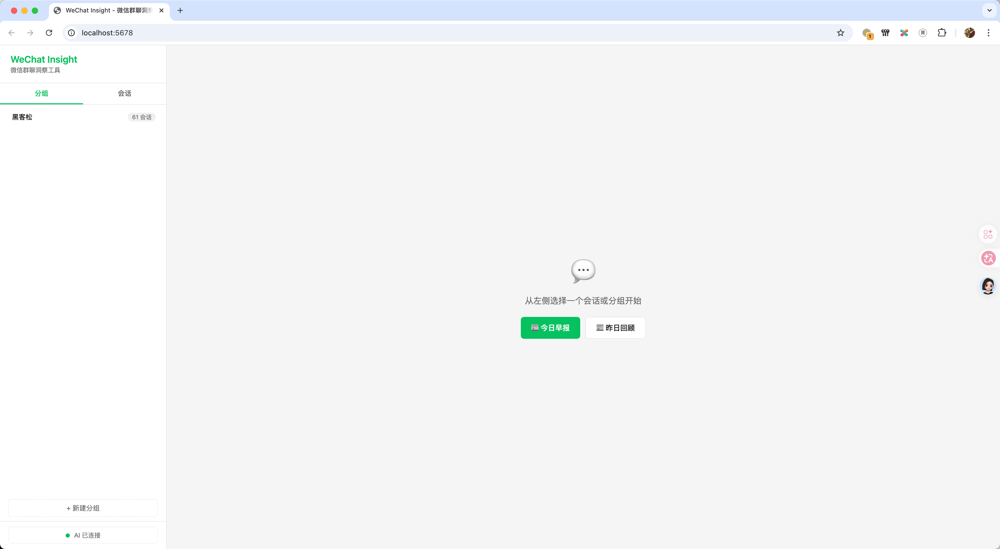
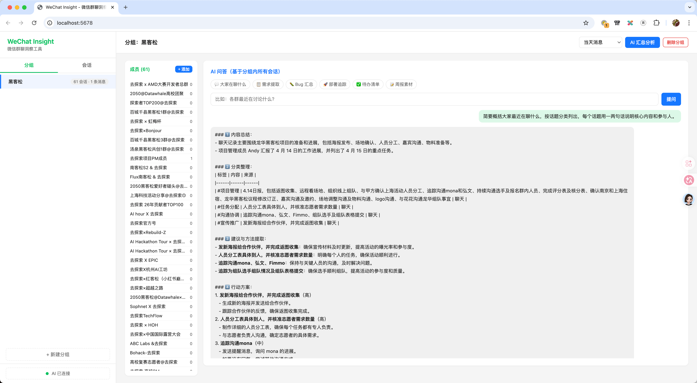

# Wechat-Insight

## 项目概述

微信聊天记录分析工具，通过 Flask Web 应用包装 `wechat-cli` 命令行工具，提供聊天记录浏览、分组管理和 AI 摘要/问答功能。






## 常用命令

```bash
# 安装依赖
pip install -r requirements.txt

# 启动应用（默认端口 5678，自动打开浏览器）
python app.py

# Windows 快捷启动
start.bat
```

无构建、测试或 lint 配置。

## 架构

**单文件 Flask 应用** (`app.py` ~617行) + **单页前端** (`templates/index.html` ~730行)

### 后端 (app.py)

- 通过 `subprocess` 调用 `wechat-cli` 获取微信聊天数据
- 30+ REST API 路由，路径格式：`/api/{resource}[/{id}][/{action}]`
- 分组数据持久化在 `data/groups.json`
- AI 功能通过 OpenAI SDK 调用兼容接口（支持自定义 base_url）

关键函数：
- `run_wechat_cli()` — subprocess 封装，所有数据获取的基础
- `get_history()` / `get_sessions()` — 聊天数据解析（正则匹配消息格式）
- `ai_summarize()` / `ai_ask()` — AI 摘要和问答
- `collect_group_messages()` — 跨会话消息聚合

### 前端 (templates/index.html)

- 原生 HTML/CSS/JS，无框架
- 侧边栏导航（会话列表/分组标签页）+ 主内容区（历史/问答/成员标签页）
- CSS 变量体系（主色 `--primary: #07c160` 微信绿）

## 配置

运行时配置优先级：环境变量 > 前端 UI 设置（`/api/config` POST）> 代码默认值

关键环境变量：`API_BASE_URL`、`API_KEY`、`MODEL_NAME`、`SYSTEM_PROMPT`

## 代码规范

- Python 使用 `snake_case`，JavaScript 使用 `camelCase`
- 代码注释使用中文
- 代码分段使用 `── ... ──` 风格的注释分隔符
